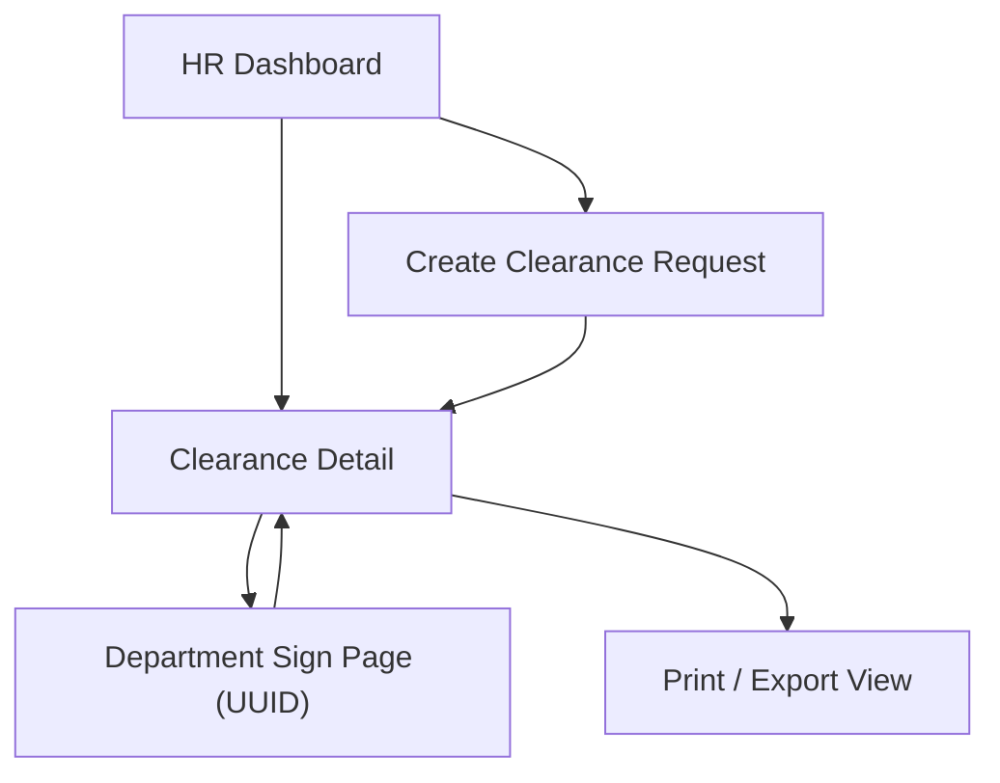

## 1. Product Overview
A Dynamic HR Clearance System that tracks employee clearance steps across departments.
HR manages requests via FastAPI HTML dashboards; departments sign via UUID-based pages with signature capture.

## 2. Core Features

### 2.1 User Roles
| Role | Registration Method | Core Permissions |
|------|---------------------|------------------|
| HR Admin/Officer | Pre-created internal account (or environment-protected access) | Create clearance requests, configure departments/steps, monitor status, export/print records |
| Employee | Identified by employee record | View clearance status and final outcome |
| Department Approver | UUID sign link (no account) | View assigned clearance request, capture signature, submit approval/rejection with comments |

### 2.2 Feature Module
Our HR clearance requirements consist of the following main pages:
1. **HR Dashboard**: request list, create request, status tracking, department/step configuration.
2. **Clearance Detail**: full clearance timeline, per-department status, print-friendly record.
3. **Department Sign Page (UUID)**: request summary, signature capture, submit decision.

### 2.3 Page Details
| Page Name | Module Name | Feature description |
|-----------|-------------|---------------------|
| HR Dashboard | Clearance request list | View all clearance requests; filter/sort by employee, status, date; open details |
| HR Dashboard | Create clearance request | Create a new request for an employee; select required departments/steps; generate per-department UUID sign links |
| HR Dashboard | Department/step configuration | Maintain list of departments and their required sign steps for clearance workflows |
| HR Dashboard | Export/print | Export/print clearance records and/or open print view per request |
| Clearance Detail | Request summary | Show employee info, request metadata, overall status, completion time |
| Clearance Detail | Department status timeline | Show each department’s status (pending/signed/rejected), timestamps, comments, and signature preview |
| Clearance Detail | Share sign links | Display (and copy) each department’s UUID sign link for distribution |
| Clearance Detail | Print view | Render a print-friendly single-page clearance record including signatures |
| Department Sign Page (UUID) | Request context | Display employee and request summary; show department name and what is being approved |
| Department Sign Page (UUID) | Signature capture | Capture handwritten signature (pointer/touch) and convert to storable image payload |
| Department Sign Page (UUID) | Decision submit | Submit approve/reject + optional comments; lock page if already completed or invalid UUID |

## 3. Core Process
**HR Admin/Officer Flow**
1. Open HR Dashboard.
2. Create a clearance request for an employee and select required departments.
3. Copy and share each department’s UUID sign link.
4. Monitor departmental signatures and final completion from Clearance Detail.
5. Print/export the final record once all required departments are completed.

**Department Approver Flow (via UUID link)**
1. Open the UUID sign page.
2. Review employee/request context.
3. Draw a signature, optionally add comments, then approve or reject.
4. Receive a confirmation message; the link becomes read-only after completion.

**Employee Flow**
1. Open the clearance detail/status view.
2. Track which departments are pending and see final outcome when completed.

