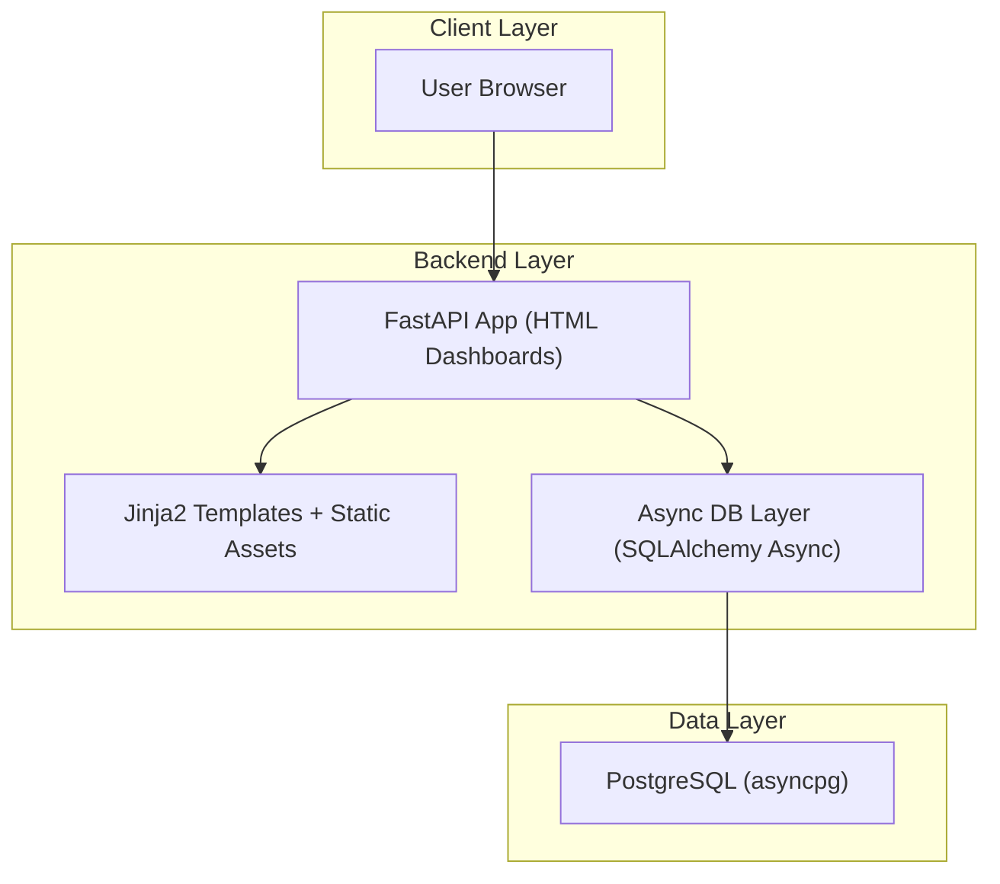
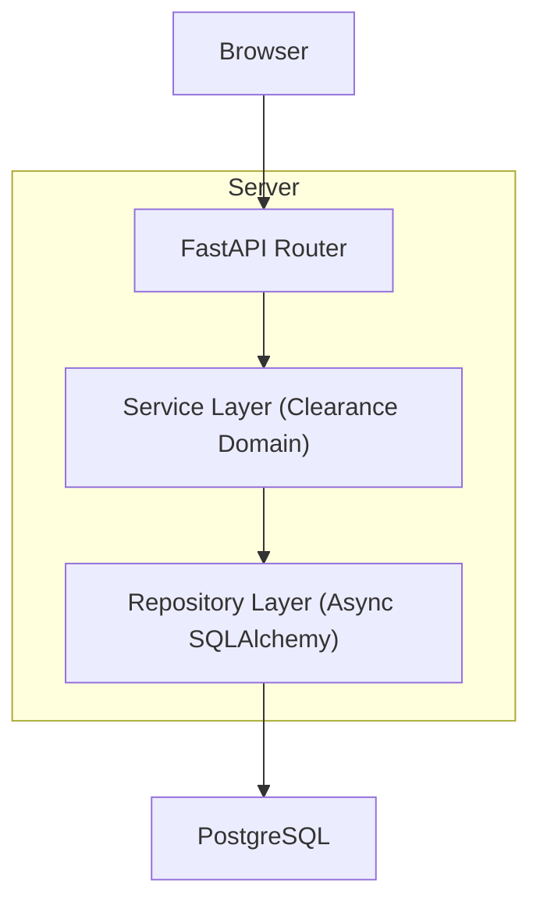
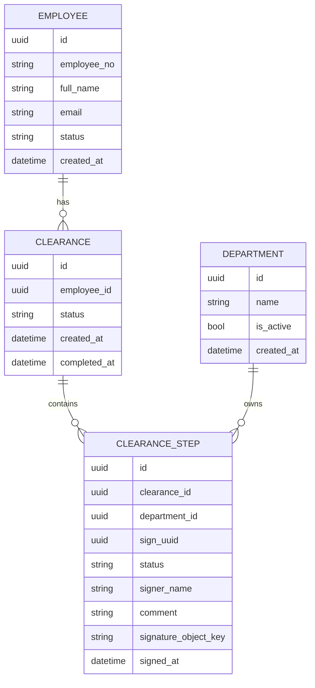

## 1.Architecture design


## 2.Technology Description
- Frontend: Server-rendered HTML dashboards (FastAPI + Jinja2 templates) + lightweight browser JS for signature capture
- Backend: FastAPI (ASGI), Python async endpoints
- Database: PostgreSQL (async) accessed via SQLAlchemy Async + asyncpg

## 3.Route definitions
| Route | Purpose |
|-------|---------|
| / | Redirect to HR dashboard or landing (implementation-dependent) |
| /hr | HR Dashboard (list, filters, create entry point) |
| /hr/clearances/new | Create clearance request (form) |
| /hr/clearances/{clearance_id} | Clearance Detail (timeline, links, print access) |
| /sign/{department_uuid} | Department Sign Page (UUID) with signature capture + decision submit |
| /print/clearances/{clearance_id} | Print-friendly clearance record |

## 4.API definitions (If it includes backend services)
### 4.1 Shared Types (Python-style, transferable to TS)
```ts
export type UUID = string;

export type ClearanceStatus = "pending" | "completed" | "rejected";
export type StepStatus = "pending" | "approved" | "rejected";

export interface Clearance {
  id: UUID;
  employee_id: UUID;
  status: ClearanceStatus;
  created_at: string;
  completed_at?: string;
}

export interface DepartmentStep {
  id: UUID;
  clearance_id: UUID;
  department_id: UUID;
  sign_uuid: UUID; // used in /sign/{sign_uuid}
  status: StepStatus;
  signed_at?: string;
  signer_name?: string;
  comment?: string;
  signature_image_url?: string; // or base64 reference
}
```

### 4.2 Core HTTP actions (HTML form oriented)
- GET /sign/{department_uuid}: Render sign page (shows current state, prevents re-sign if completed)
- POST /sign/{department_uuid}: Accept signature + decision (approve/reject) + optional comment

## 5.Server architecture diagram (If it includes backend services)


## 6.Data model(if applicable)

### 6.1 Data model definition


### 6.2 Data Definition Language
Employee Table (employees)
```sql
CREATE TABLE employees (
  id UUID PRIMARY KEY,
  employee_no VARCHAR(50) UNIQUE NOT NULL,
  full_name VARCHAR(200) NOT NULL,
  email VARCHAR(255),
  status VARCHAR(30) DEFAULT 'active',
  created_at TIMESTAMPTZ NOT NULL DEFAULT NOW()
);

CREATE INDEX idx_employees_employee_no ON employees(employee_no);
```

Department Table (departments)
```sql
CREATE TABLE departments (
  id UUID PRIMARY KEY,
  name VARCHAR(120) UNIQUE NOT NULL,
  is_active BOOLEAN NOT NULL DEFAULT TRUE,
  created_at TIMESTAMPTZ NOT NULL DEFAULT NOW()
);
```

Clearance Table (clearances)
```sql
CREATE TABLE clearances (
  id UUID PRIMARY KEY,
  employee_id UUID NOT NULL,
  status VARCHAR(30) NOT NULL DEFAULT 'pending',
  created_at TIMESTAMPTZ NOT NULL DEFAULT NOW(),
  completed_at TIMESTAMPTZ
);

CREATE INDEX idx_clearances_employee_id ON clearances(employee_id);
CREATE INDEX idx_clearances_created_at ON clearances(created_at DESC);
CREATE INDEX idx_clearances_status ON clearances(status);
```

Clearance Steps Table (clearance_steps)
```sql
CREATE TABLE clearance_steps (
  id UUID PRIMARY KEY,
  clearance_id UUID NOT NULL,
  department_id UUID NOT NULL,
  sign_uuid UUID UNIQUE NOT NULL,
  status VARCHAR(30) NOT NULL DEFAULT 'pending',
  signer_name VARCHAR(200),
  comment TEXT,
  signature_object_key TEXT,
  signed_at TIMESTAMPTZ
);

CREATE INDEX idx_steps_clearance_id ON clearance_steps(clearance_id);
CREATE INDEX idx_steps_department_id ON clearance_steps(department_id);
CREATE INDEX idx_steps_status ON clearance_steps(status);
```

Notes
- Signature storage can be implemented as a DB text field (base64) or as an object key to a storage backend; the schema uses `signature_object_key` to keep DB rows small.
- Runtime constraints from your request: Dockerized service listens on port 8518; container entrypoint runs `HR_App.py`.